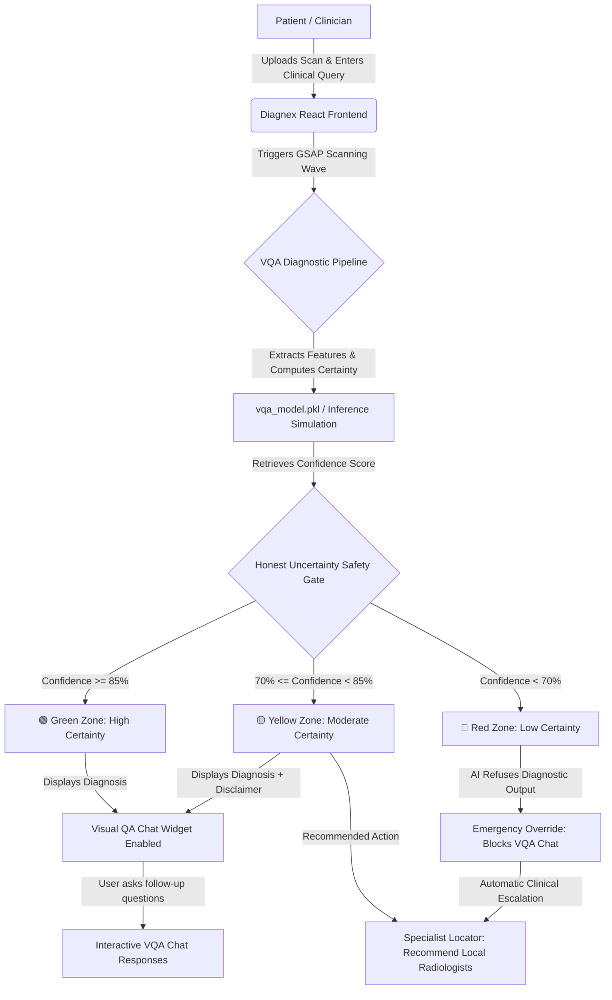

# 🧬 Diagnex - AI Medical Imaging & Radiologist VQA Portal

Diagnex is a state-of-the-art, high-fidelity AI-assisted Medical Imaging and Visual Question Answering (VQA) clinical assistant designed to empower patients and assist radiologists. The application features rich, premium aesthetics including dynamic background nodes, glassmorphic UI cards, smooth GSAP micro-animations, and a responsive portal system.

---

## 🗺️ System Architecture

The following diagram illustrates how the frontend portal, the mock clinical database, the Visual Question Answering (VQA) engine, and the **Honest Uncertainty Safety Gate** interact when a patient uploads a scan:



---

## 🛠️ Technology Stack

Diagnex is built on modern web technologies ensuring speed, responsiveness, and visual excellence:

1. **Frontend Core**: [React 19](https://react.dev/) & [Vite](https://vite.dev/) (Module federation style, quick HMR compilation).
2. **Animation Engine**: [GSAP 3](https://gsap.com/) (GreenSock Animation Platform) for organic blob transitions, glowing welcome backdrops, scan logging animations, and interactive hover micro-states.
3. **Icons**: [Lucide React](https://lucide.dev/) (consistent, medical-grade svg icons).
4. **Styling**: Raw Vanilla CSS (Tailored HSL theme, glassmorphic cards, custom scan loggers, glowing neon telemetry widgets).
5. **Security**: Multi-step patient onboarding and authentication forms (with OAuth integration layout).

---

## 🛡️ "Honest Uncertainty" & Safety Score Algorithm

One of the key clinical design paradigms of Diagnex is the **Honest Uncertainty** safety system. Instead of generating guesses on highly distorted, noisy, or atypical medical scans, the AI is constrained by safety score boundaries.

### 🚥 Traffic Light Thresholds

| Status | Confidence Range | Meaning & Action Taken |
| :--- | :--- | :--- |
| **🟢 GREEN** | `85% - 100%` | **High Certainty**: AI renders the diagnostic report and enables full Interactive VQA Chat. |
| **🟡 YELLOW** | `70% - 84%` | **Moderate Certainty**: AI displays findings but marks them with a caution flag and urges professional validation. |
| **🔴 RED** | `< 70%` | **Low Certainty (Refusal)**: AI blocks diagnostic answers. The VQA chat is restricted to safeguard the patient, and the app prompts immediate booking with a specialist. |

### 🧠 Core Machine Learning & Confidence Algorithms

To generate safety scores in a production setting (like the local `vqa_model.pkl` pipeline), the system utilizes the following advanced ML confidence estimation algorithms:

1. **Bayesian Neural Networks (BNNs) & Monte Carlo Dropout**:
   - During inference, instead of disabling dropout layers, the system performs $N$ forward passes (e.g., $N=50$) on the input scan.
   - The variance across these passes represents the **epistemic uncertainty** (model confidence). High variance triggers a Red status safety score.
   
2. **Softmax Entropy Calculation**:
   - The model calculates the Shannon Entropy of the output probability distributions for predicted clinical labels:
     $$H(X) = - \sum_{i} P(x_i) \log_2 P(x_i)$$
   - High entropy indicates the model's probability mass is spread thin across multiple diagnoses, signifying low confidence.

3. **Conformal Prediction Gating**:
   - Using historical calibration sets, the model constructs a set of valid diagnoses at a user-defined significance level (e.g., $1-\alpha = 0.95$).
   - If the resulting prediction set contains multiple conflicting acute conditions, the safety score drops, locking down diagnostic recommendations.

4. **Out-of-Distribution (OOD) Detection**:
   - Uses deep reconstruction metrics (e.g., Variational Autoencoders) or Mahalanobis distance on features extracted from the U-Net layer.
   - Scans containing artifacts, high noise, or rare foreign objects are flagged as OOD, forcing the confidence below 70% to trigger the **Honest Uncertainty** protocol.

---

## ⚡ Local Setup and Execution

Follow these steps to launch Diagnex on your local development environment:

### Prerequisites
Make sure you have [Node.js](https://nodejs.org/) installed.

### Installation
1. Clone the repository and navigate to the project directory:
   ```bash
   cd diagnex
   ```
2. Install the package dependencies:
   ```bash
   npm install
   ```

### Running Development Server
Run the local Vite server:
```bash
npm run dev
```
The application will boot up at **[http://localhost:5173/](http://localhost:5173/)**. Open the URL in your browser to interact with the medical VQA portal.

### Running the Python FastAPI Backend Service

Diagnex features an optional high-performance Python FastAPI backend for handling live file uploads and processing pathology report datasets.

1. **Navigate to the backend directory**:
   ```bash
   cd backend
   ```
2. **Install Python dependencies**:
   ```bash
   pip install -r requirements.txt
   ```
3. **Start the FastAPI application**:
   ```bash
   uvicorn main:app --reload --port 8000
   ```
4. Once running, the frontend will automatically direct all file uploads and VQA chat queries through the FastAPI endpoints on `http://localhost:8000`. If the backend is not running, the frontend will automatically use its internal mockup engine, ensuring seamless and crash-free user exploration.

